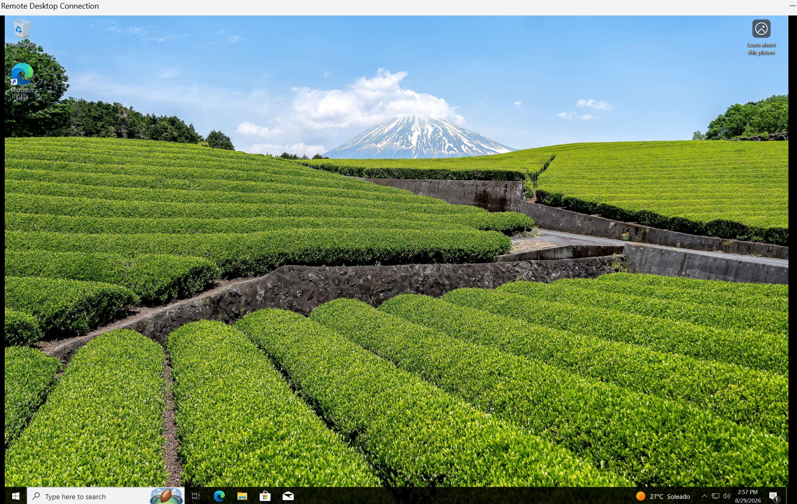
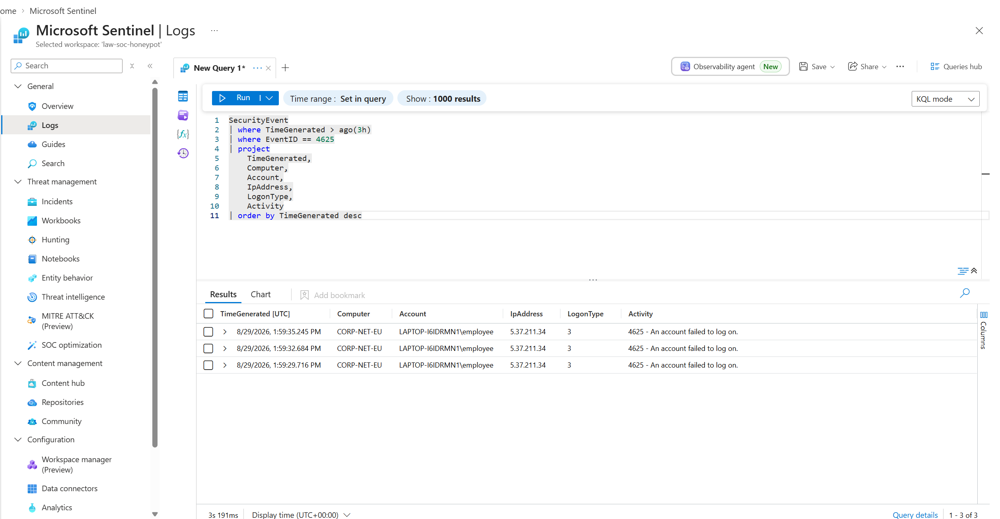
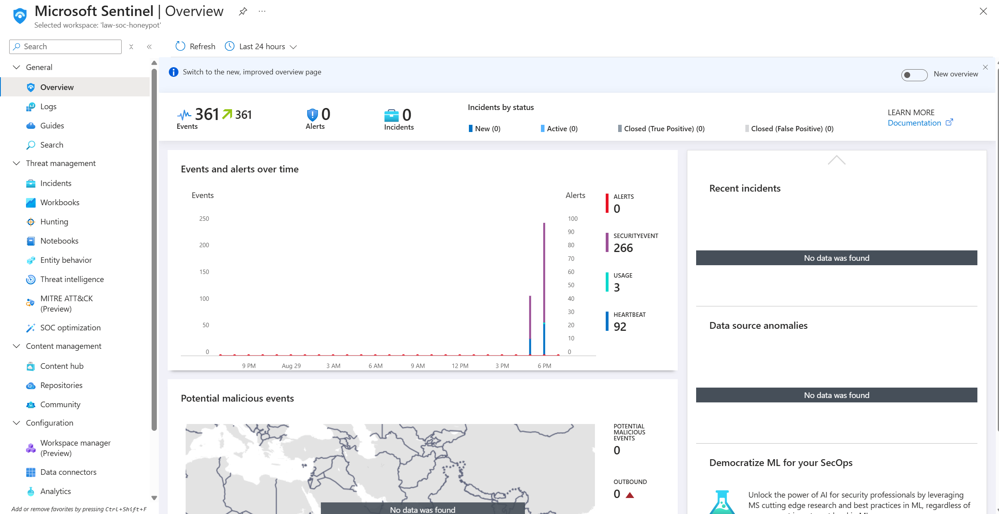
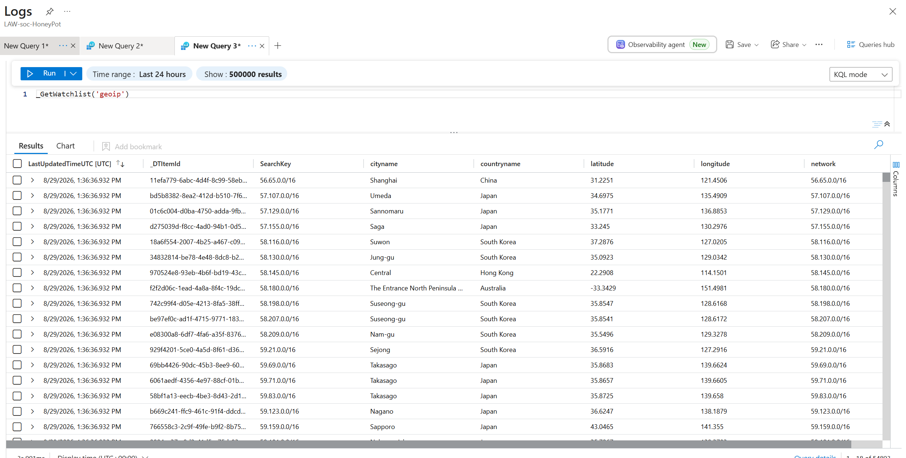
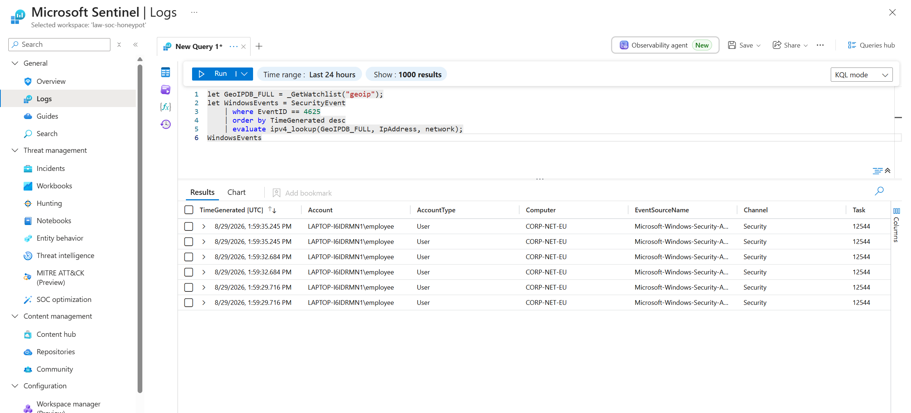
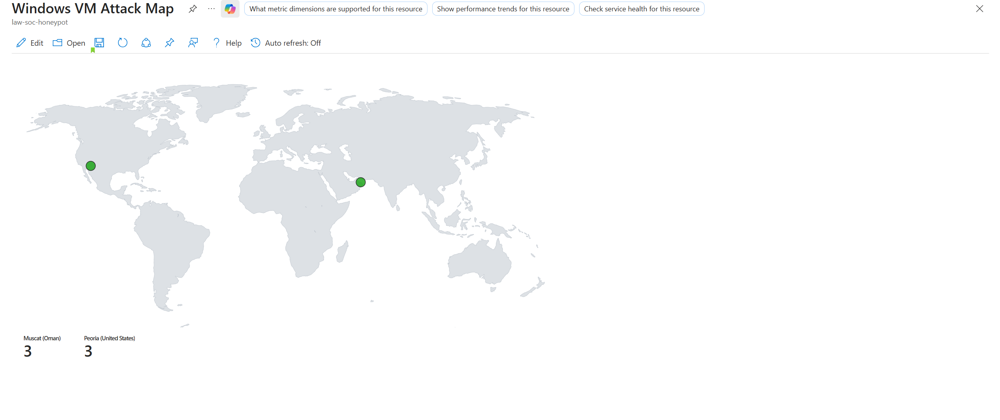

# Azure Sentinel Honeypot & Attack Detection

## Overview

Built an Azure-based honeypot and security monitoring environment to simulate and investigate unauthorized authentication attempts against a Windows virtual machine.

The project uses **Microsoft Sentinel** and **Azure Log Analytics** to collect and analyze Windows security events, with **KQL** used to identify failed authentication attempts. Attacker IP addresses are enriched with geographic information using a Sentinel Watchlist, and the resulting data is visualized through an interactive attack map.

The project demonstrates practical experience with cloud security monitoring, SIEM configuration, log analysis, KQL, threat investigation, and security visualization.

---

## Objectives

- Deploy a Windows virtual machine as a honeypot in Microsoft Azure
- Expose the VM to simulated unauthorized access attempts
- Generate and investigate Windows authentication events
- Centralize security logs using Azure Log Analytics
- Configure Microsoft Sentinel for security monitoring
- Collect Windows Security Events using Azure Monitor Agent
- Investigate authentication failures using KQL
- Enrich attacker IP addresses with geographic information
- Visualize attack activity using a Microsoft Sentinel Workbook

---

## Architecture

```text
                    ┌─────────────────────┐
                    │      Attacker       │
                    └──────────┬──────────┘
                               │
                               ▼
                    ┌─────────────────────┐
                    │   Azure Windows VM  │
                    │      Honeypot       │
                    └──────────┬──────────┘
                               │
                               │ Windows Security Events
                               ▼
                    ┌─────────────────────┐
                    │ Azure Monitor Agent │
                    │        (AMA)        │
                    └──────────┬──────────┘
                               │
                               ▼
                    ┌─────────────────────┐
                    │ Data Collection Rule│
                    │       (DCR)         │
                    └──────────┬──────────┘
                               │
                               ▼
                    ┌─────────────────────┐
                    │  Log Analytics      │
                    │     Workspace       │
                    └──────────┬──────────┘
                               │
                               ▼
                    ┌─────────────────────┐
                    │ Microsoft Sentinel  │
                    └──────────┬──────────┘
                               │
                    ┌──────────┴──────────┐
                    ▼                     ▼
             ┌──────────────┐      ┌──────────────┐
             │   KQL Query  │      │ GeoIP         │
             │ Investigation│      │ Watchlist     │
             └──────┬───────┘      └──────┬───────┘
                    │                     │
                    └──────────┬──────────┘
                               ▼
                    ┌─────────────────────┐
                    │ Sentinel Workbook   │
                    │    Attack Map       │
                    └─────────────────────┘
```

---

## Technologies & Services

- **Microsoft Azure**
- **Microsoft Sentinel**
- **Azure Log Analytics Workspace**
- **Azure Monitor Agent (AMA)**
- **Data Collection Rules (DCR)**
- **Windows 10**
- **Windows Event Viewer**
- **Kusto Query Language (KQL)**
- **Sentinel Watchlists**
- **Microsoft Sentinel Workbooks**

---

## Project Implementation

### 1. Azure Honeypot

A Windows virtual machine was deployed in Microsoft Azure and configured as the honeypot environment.

The associated Network Security Group was configured to permit inbound traffic, allowing authentication attempts to reach the VM.

Windows Firewall was disabled within the controlled lab environment to allow the honeypot to receive connection attempts.

---

### 2. Authentication Event Generation

Multiple unsuccessful authentication attempts were generated against the Windows VM.

These attempts produced Windows Security Event **4625**, which represents a failed account logon.

Windows Event Viewer was used to verify that the events were being generated locally before configuring centralized log collection.

---

### 3. Centralized Log Collection

An **Azure Log Analytics Workspace** was created to act as the central repository for security telemetry.

Microsoft Sentinel was connected to the workspace, and the **Windows Security Events via AMA** data connector was configured.

A Data Collection Rule was used to configure the collection and forwarding of Windows security events from the VM.

This allowed the Windows authentication events to be queried centrally rather than relying solely on local Event Viewer logs.

---

### 4. KQL Investigation

Kusto Query Language was used to investigate the collected Windows security events.

Example query:

```kql
SecurityEvent
| where EventID == 4625
| project TimeGenerated, Computer, Account, IpAddress
| order by TimeGenerated desc
```

This filters the security event data for failed authentication attempts and displays key investigation fields such as:

- Timestamp
- Hostname
- Account
- Source IP address

---

### 5. GeoIP Enrichment

The authentication events contained source IP addresses but did not directly provide geographic information.

A GeoIP dataset was imported into Microsoft Sentinel as a **Watchlist** using the search key `network`.

The watchlist was then joined with the security events using the source IP address.

Example:

```kql
let GeoIPDB_FULL = _GetWatchlist("geoip");
let WindowsEvents = SecurityEvent
    | where EventID == 4625
    | order by TimeGenerated desc
    | evaluate ipv4_lookup(GeoIPDB_FULL, IpAddress, network);
WindowsEvents
```

This enrichment provides additional context that can be used during security investigations, including geographic information associated with source IP addresses.

---

### 6. Attack Map Visualization

A Microsoft Sentinel Workbook was created to visualize the enriched authentication events geographically.

The workbook uses the enriched security-event data to display attack activity on an interactive map, providing a visual representation of the geographic origin of observed authentication attempts.

---

## Key Security Concepts Demonstrated

### SIEM

Configured Microsoft Sentinel as a cloud-based SIEM to centralize and investigate security telemetry.

### Log Analysis

Analyzed Windows Security Events to identify authentication failures and investigate suspicious activity.

### KQL

Used Kusto Query Language to filter, investigate, transform, and enrich security telemetry.

### Threat Detection

Identified failed authentication activity using Windows Event ID 4625.

### Log Enrichment

Combined security telemetry with external geographic data to provide additional context around source IP addresses.

### Security Visualization

Built a Sentinel Workbook to visualize authentication activity geographically.

### Cloud Security

Deployed and monitored a Windows workload within Microsoft Azure and integrated it with Azure-native security monitoring services.

---

## Skills Demonstrated

`Azure` `Microsoft Sentinel` `SIEM` `KQL` `Log Analysis` `Threat Detection` `Windows Security Events` `AMA` `DCR` `Watchlists` `GeoIP Enrichment` `Security Monitoring` `Cloud Security` `Incident Investigation`

---

## Disclaimer

This project was conducted in a controlled lab environment for educational and cybersecurity training purposes. No unauthorized systems were targeted.

## Screenshots

### Azure Windows Honeypot

The Windows virtual machine deployed in Azure and used as the monitored honeypot.



### Windows Security Events

Windows Event Viewer showing failed authentication events generated by the honeypot.



### Microsoft Sentinel

Microsoft Sentinel configured to monitor security telemetry from the Azure environment.



### Failed Login Investigation

KQL used to identify and investigate failed Windows authentication attempts.


### GeoIP Watchlist

The GeoIP dataset imported into Microsoft Sentinel as a Watchlist.



### GeoIP Enrichment

Security events enriched with geographic information using the GeoIP Watchlist.



### Geographic Attack Map

A Microsoft Sentinel Workbook visualizing failed authentication activity based on the geographic location of source IP addresses.


